## 注意：使用ExlinkPro的数控电源输出时必须连接支持PD3.0协议的充电器使用，不要使用内置电池直接输出或者连接电脑USB口（电流较小，大约为500ma）输出，避免电源异常。焊接和使用请注意安全！
# **项目简介：为什么要升级Exlink？**
原版Exlink存在几个问题：
- LVGL触摸屏不够丝滑，容易误触
- 充电电路和供电电路没有合路，拔插数据线会重启，充电电路不稳定
- 输出电压范围太小，无法线性调节输出电压

# **Exlink和ExlinkPro功能对比**

|  | Exlink | ExlinkPro |
| --- | --- |--- |
| 电源保护 | 自恢复保险丝 | 电子保险丝MP5016|
| 充电方案 | 线性充电芯片 | 开关充电芯片MP2615|
| 数控电源方案 | BUCK芯片+数字电位器 |四开关BUCKBOOST芯片MP28167+IIC配置输出|
| 输出电压范围 | 1.221-11v（可配置） | 0-20v（可配置）|
| 输出电流范围 | 0-5A | 0-3A（可配置）|
| 电源开关 | 双向背靠背MOS管 | 继电器|
| UI界面 | LVGL | LVGL|
| 电池大小 | 300mah | 600mah|
| 调试功能 | DAPlink、逻辑分析仪、IIC设备地址搜索、串口助手、数控电源、无线下载器、无线串口、PWM输出、简易示波器 | DAPlink、逻辑分析仪、IIC设备地址搜索、串口助手、数控电源、无线下载器、无线串口、PWM输出、简易示波器|
# **立创开源平台链接：**
# **资料下载链接：**

# **固件烧录教程在**：https://blog.csdn.net/physicsexpert/article/details/145067001?spm=1001.2014.3001.5502

# **产品实物图**

## 外观对比

## 内部结构

## 引脚功能界面
 
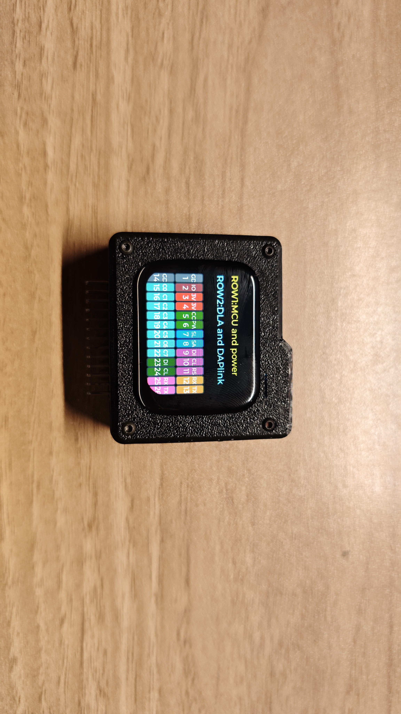

## 数控电源界面

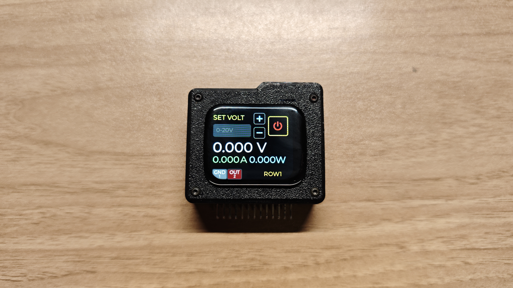

## 排针引脚功能：

## 系统框图：

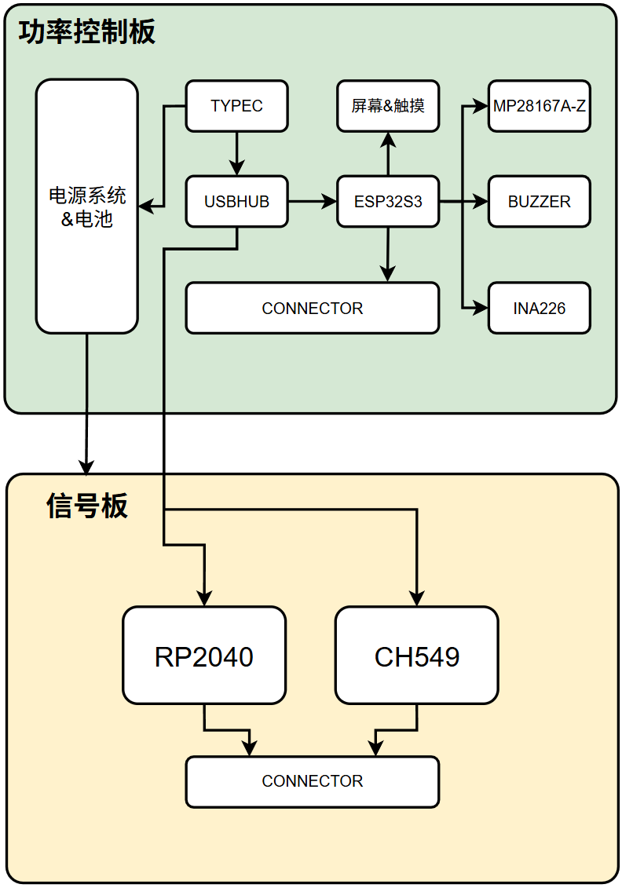

## 电源树：

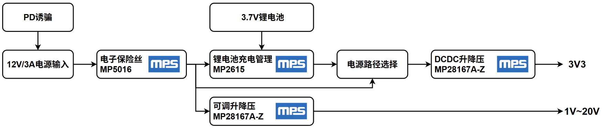

# **硬件改进说明（重要必看！）**
项目由两块PCB构成，电源控制板为四层板，信号板为两层板，采用分立叠板设计，通过1.27mm排针连接：
- 电源控制板：主要负责调试器与电脑的通信、数控电源、简易示波器、屏幕显示、无线下载器等功能
- 信号板：主要负责逻辑分析仪和DAPlink等功能

ExlinkPro主要改进了电源控制板，信号板只改变了尺寸和按键位置
## 关于数控电源方案的详细说明
Exlink的数控电源输出方案采用的是pd诱骗至高电压再经过buck降压的方案，通过在反馈回路接入数字电位器配置输出电压，这种电源方案存在两个问题：一个是由于buck电路只能实现降压，调压范围有限，另一个则是由于数字电位器的调压方案，导致输出电压是一个关于反馈电阻的反比例函数，无法实现线性的电压步进调节。

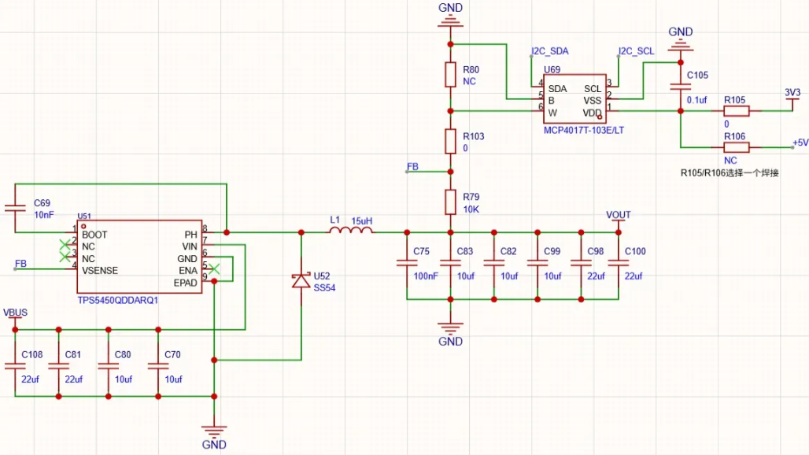

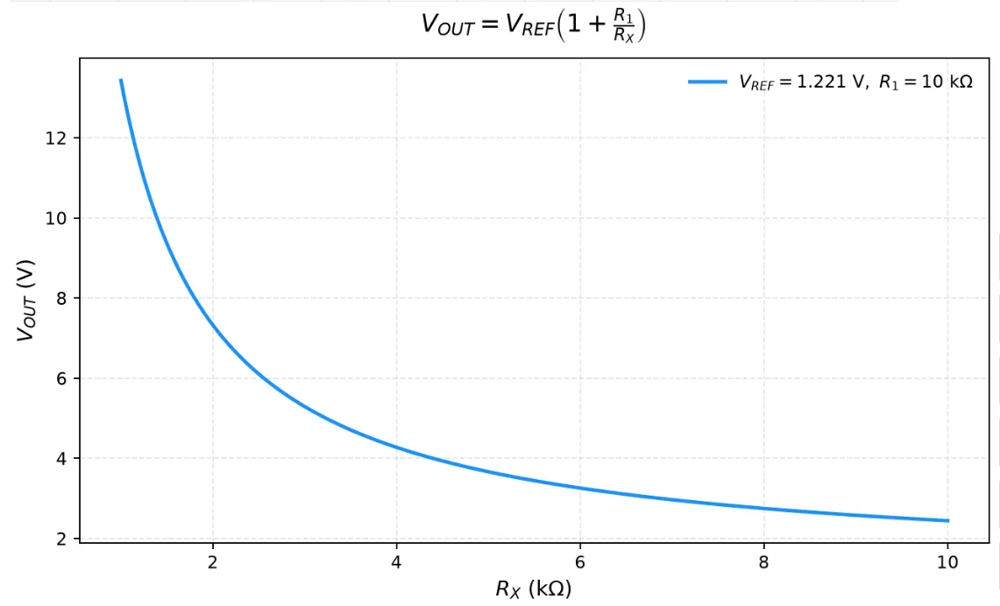

所以ExlinkPro改进了硬件方案，采用mp28167四开关buckboost芯片，mp28167的控制策略是当输入电压大于输出电压时，采用buck模式，当输入电压小于输出时，采用boost模式，当输入电压接近输出电压时，采用buckboost模式，这种开关电源拓扑的好处是可以实现宽输入宽输出，输入电压可以做到2.8-22V的范围，输出可以做到0-20v可调。

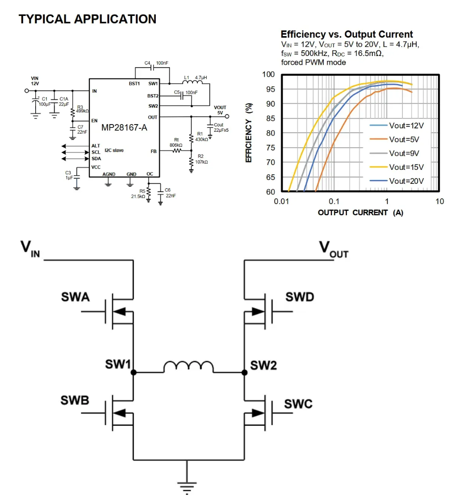

采用mp28167的另一个好处是电压调整的步进，Exlink原版的方案采用buck搭配数字电位器的方案，输出电压无法线性调节，mp28167搭载了iic数字接口，我们可以采用iic配置参考电压，大大提高了输出电压的丝滑程度，因为改变参考电压的方法相当于构建了输出电压和电压参考的一次函数，输出电压可以线性调节，且最低分度值可以做到0.08v乘以分压倍率，我在软件里设置的是100mv，可以自己修改（main.cpp文件中）。

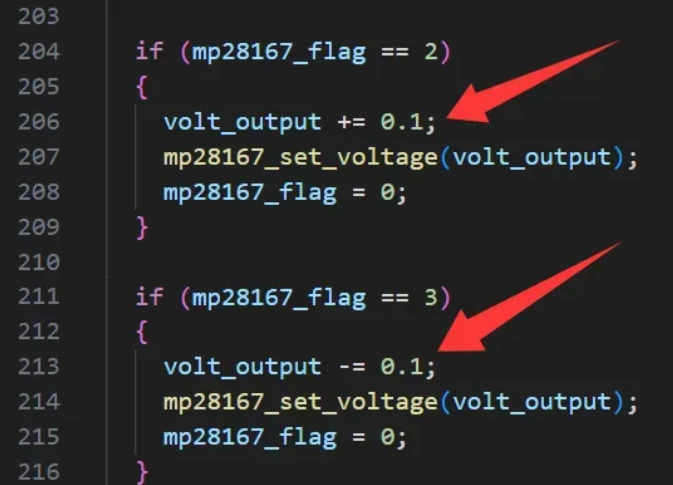

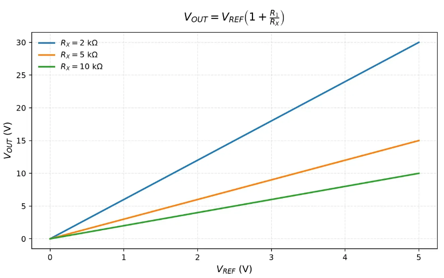

## 关于mp28167的购买（重要！）
mp28167必须购买带-A-Z后缀的型号（芯片上丝印前三个字母为BKN），否则电压无法调节

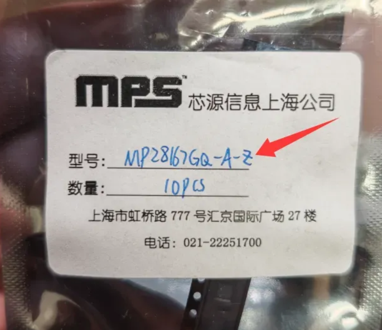

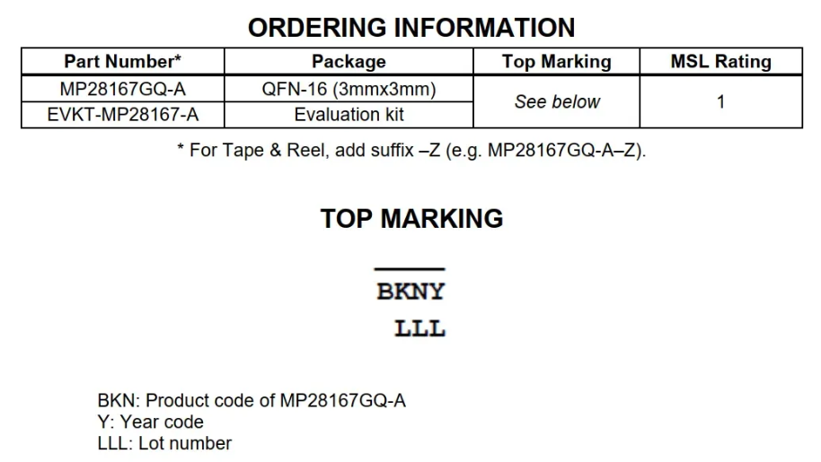

具体关于mp28167的不同型号的功能对比我列了张表

|  mp28167 | mp28167-A |mp28167-B | mp28167-N |
| --- | --- | --- | --- |
|  固定5V输出，没有iic接口| 可调输出，有iic接口，参考电压默认1v | 可调输出，有iic接口，参考电压默认0.54v|优化版，可调输出，有iic接口，参考电压默认1v|

## 关于mp5016
mp5016是电子保险丝，可以通过连接到ILIMIT引脚和DV/DT引脚的电阻电容配置电流限制和缓启动时间，具体方法如下

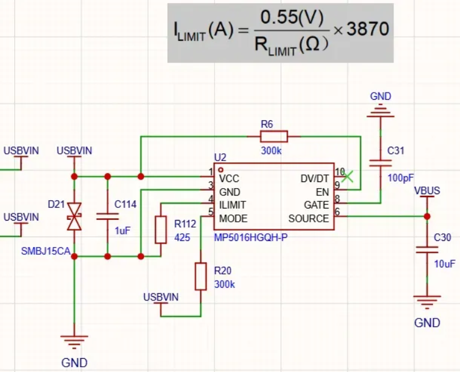

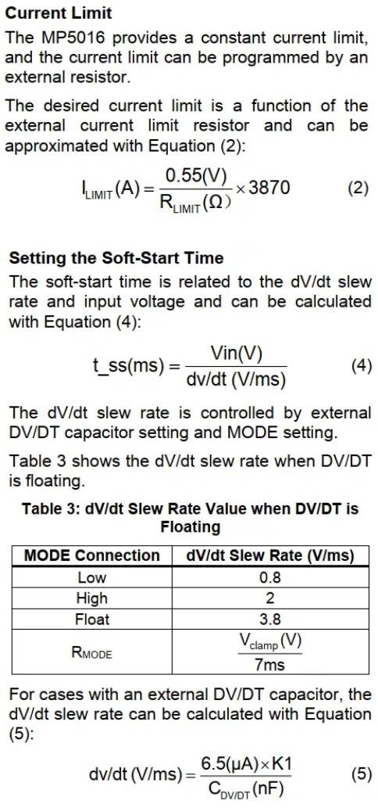

## 关于mp2615
mp2615是开关型单节锂电池充放电管理芯片，需要根据你买的电池容量选择充电电流，一般为电池容量的一半（单位是A）也就是0.5C，通过更换采样电阻R19配置充电电流

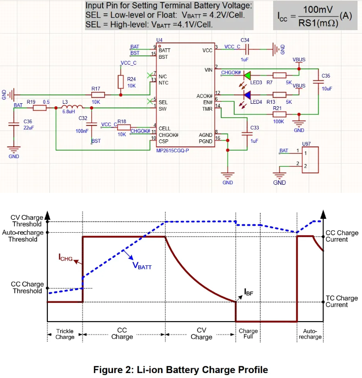

## 关于电容

Exlink原版电源方案采用的是0402电容，后来发现0402的大容量且耐压高于25v的电容很难购买且价格较贵，所以ExlinkPro的电源控制板的电源方案换成了0603电容，需要注意的是除了电容的容值和原理图一样之外，还需要满足电容的耐压大于25v

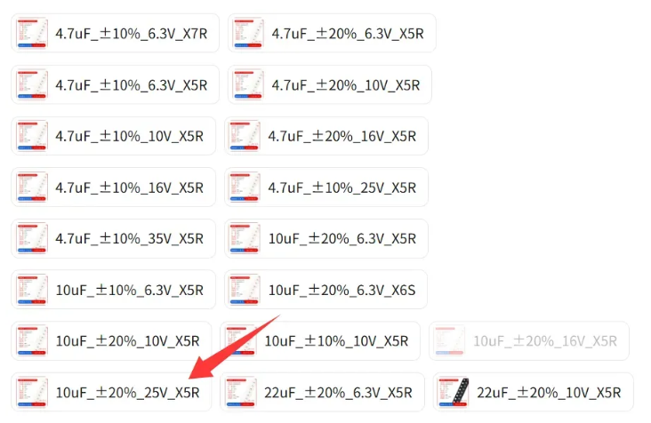

## 关于电感
ExlinkPro采用的是0630的功率屏蔽电感，需要满足饱和电流（Isat）和温升电流（Irms）大于5A，具体可以参考电感的数据手册

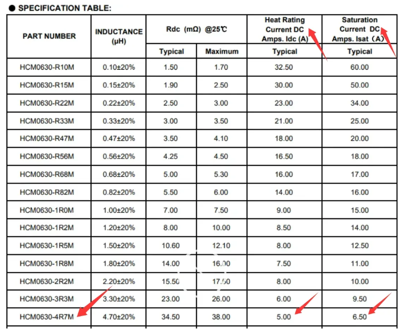

## 关于电池
我使用的电池容量为600ma，尺寸为长48mm×宽30mm×高4mm

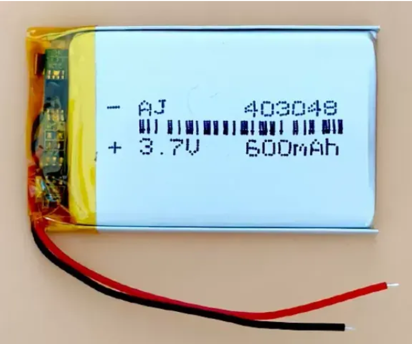

# **软件和结构说明（和Exlink相同）**

项目的软件基于VScode+PIO，移植了LVGL作为UI界面，整体代码逻辑为状态机+前后台。

## 代码结构
Exlink项目文件夹下包含以下几个文件：

### .pio        （pio配置文件）
### .vscode     （vscode配置文件）
### build       （编译生成的文件）
### include     （包含的头文件）
### lib         （包含的库文件）
- Arduino-CST816T-Library （CST816T库）
- INA-master（INA226库）
- lvgl（lvgl库）
- TFT_eSPI（屏幕驱动库）
### src（源文件）
- main.cpp（主程序文件）
- ui.c（ui文件）
- ui.h（ui头文件）
- main_png.c（图片数组文件）
- event.c（事件回调文件）
- event.h（事件回调头文件）
### test        （测试文件）
### .gitignore  （屏蔽文件）
### my.csv      （ESP32S3内存分配表） 
### platformio.ini（pio项目配置文件）

## 切换逻辑

我们首先将整个调试器的功能划分为几个应用，以数控电源为例，当我们未启动这个应用时，应用此时处于后台状态，标志位为0，不占用系统资源，当我们选中这个应用时（如点击这个应用图标），标志位置1，系统执行一系列初始化（如加载应用界面，数字电位器初始化，功率计初始化等），应用进入前台运行，当我们取消任务时，系统执行一些列关闭操作（如失能通信接口，关闭定时器，关闭应用界面等），标志位置0，应用重新回到后台。

如果前后台任务冲突，可能会导致单片机内存报错重启。

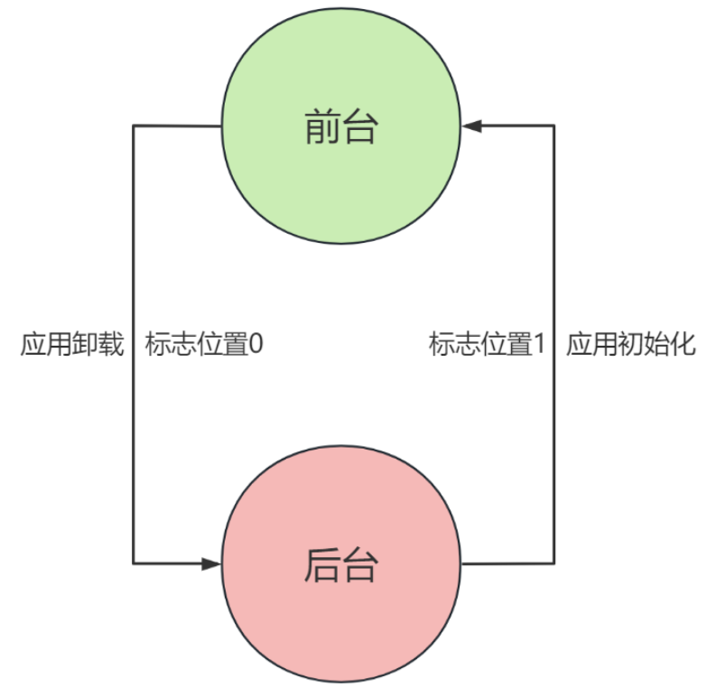

# **结构说明（和Exlink相同）**

调试器外壳采用3D打印制作，总共需要打印三个部分：顶壳，底壳，开关，底壳上需要用电烙铁压入M2热熔螺母，屏幕可以使用502胶粘在顶壳上，开关结构件需要插入开关柄内，固定螺丝使用四颗16mmM2螺丝拧入即可。

# **固件下载和烧录（和Exlink相同）**
本项目的三颗主控芯片（ESP32S3、RP2040、CH549）需要分别烧录固件：

- ESP32S3烧录：首先需要在vscode安装platformio插件，使用vscode打开software文件夹中的Exlink文件，vscode会自动安装ESP32S3编译环境（时间可能会比较久），之后按住电源控制板上的boot按键插上板子的usbtypec接口，插上后松开boot按键，ESP32S3会加入下载模式，然后选择对应的com口，点击下载，下载完成后复位即可。

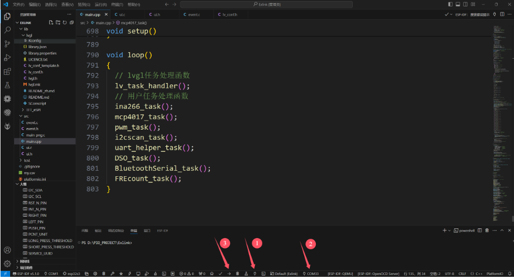

- RP2040烧录：按住信号板上的boot键插入USB，电脑就能识别成U盘，然后把pico_sdk_sigrok.uf2固件复制进去即可。具体使用方法参考:
[RP2040逻辑分析仪](https://blog.csdn.net/qq1003155077/article/details/130841838?ops_request_misc=%257B%2522request%255Fid%2522%253A%252257B0188D-17C5-4AC1-99E7-A6468258EC39%2522%252C%2522scm%2522%253A%252220140713.130102334..%2522%257D&amp;request_id=57B0188D-17C5-4AC1-99E7-A6468258EC39&amp;biz_id=0&amp;utm_medium=distribute.pc_search_result.none-task-blog-2~all~baidu_landing_v2~default-6-130841838-null-null.142^v100^pc_search_result_base6&amp;utm_term=%E6%A0%91%E8%8E%93%E6%B4%BEpico%E9%80%BB%E8%BE%91%E5%88%86%E6%9E%90%E4%BB%AA&amp;spm=1018.2226.3001.4187)
- CH549烧录：选中CH549的usb接口，使用WCHISPTool烧录固件即可。具体使用方法参考:https://oshwhub.com/hhh89/wch-link-v2

# **使用说明（和Exlink相同）**
- 使用数控电源功能时需要配合支持PD协议的充电器连接双c口线使用。
- 使用串口助手和无线串口时需要在串口发送端的串口数据末尾加上换行符“/n”。
- 无线串口需要配合手机蓝牙调试器APP使用，用手机显示蓝牙串口信息。
具体方法为：下载蓝牙调试器APP：https://gitee.com/xie-rongji/bt_mcu
打开Exlink的无线串口功能，在蓝牙调试APP中选中Exlink，由于使用的是低功耗蓝牙，所以需要在APP中选择服务的uuid，之后点击连接打开调试界面即可看到串口发送的信息。

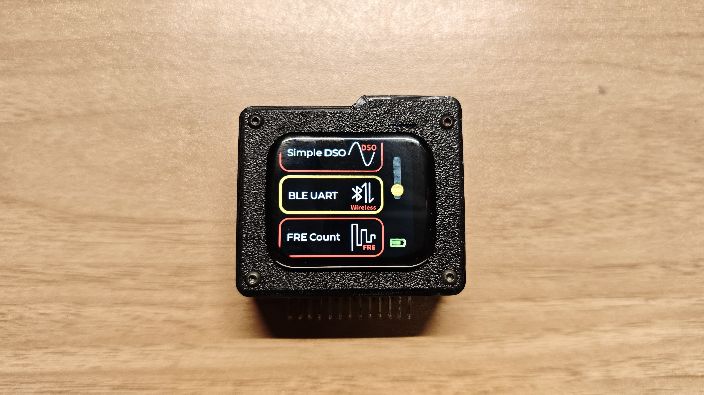

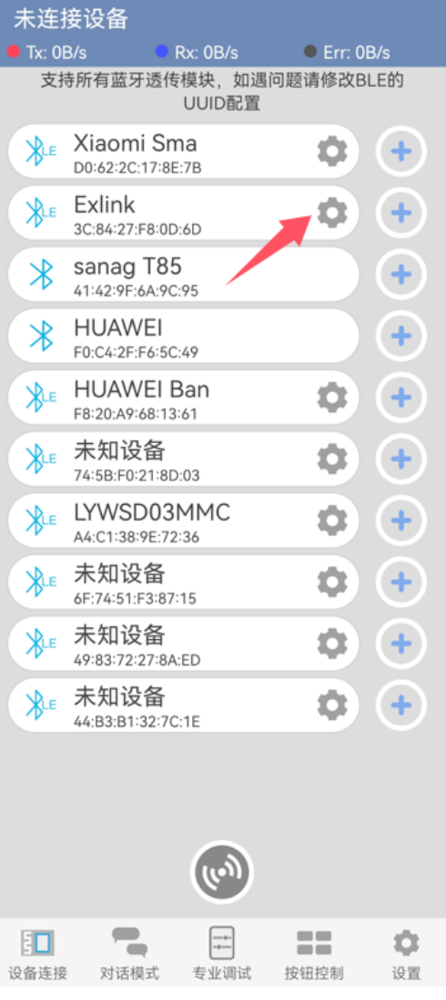

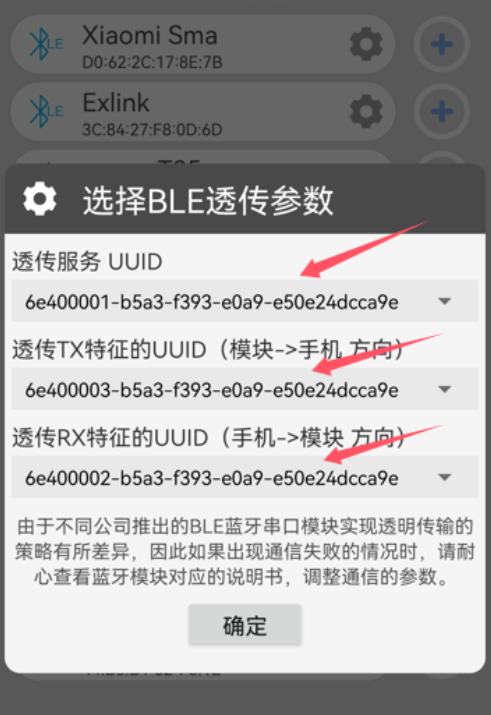

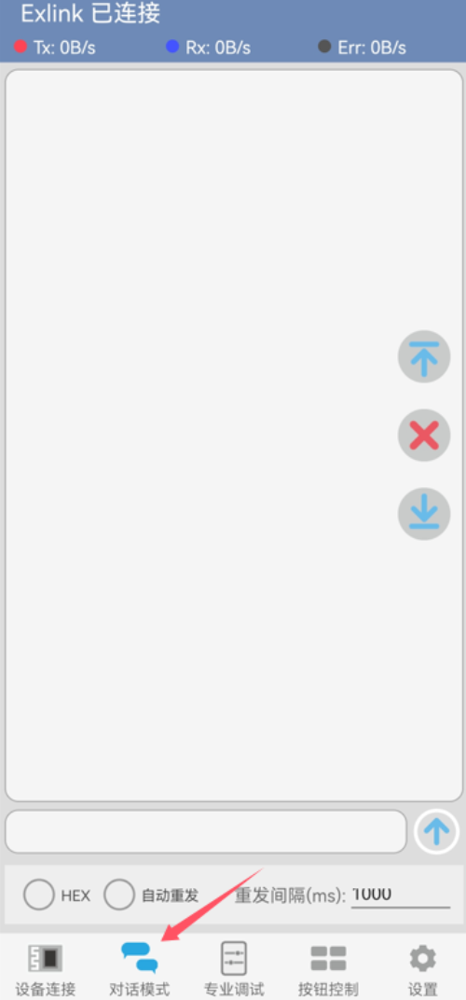

# **参考资料**
本项目参考了很多开源资料，在此表示感谢：

- LVGL：https://github.com/lvgl
- 正点原子LVGL开发指南：http://www.openedv.com/docs/index.html
- RP2040逻辑分析仪项目：https://github.com/gusmanb/logicanalyzer
- 基于CH549的DAPlink项目：https://oshwhub.com/hhh89/wch-link-v2
- 多功能调试器设计：https://github.com/physicsexpert/felini-firmware
- 稚晖君peak项目：https://github.com/peng-zhihui/Peak
- 显示屏相关设计：https://oshwhub.com/eedadada/monica
- 基于ESP32S3的无线下载器：https://github.com/windowsair/wireless-esp8266-dap
- ESP32S3固件在线烧录：https://yunsi.studio/wireless-proxy/online-flasher
- 蓝牙调试器APP开源：https://gitee.com/xie-rongji/bt_mcu

此外，很多同学也对本项目提出了宝贵的意见，在此也表示感谢：

- 刘文俊同学对电源相关设计提出的意见
- 孟祥钦同学对功能需求提出的意见
- 陈家辉同学对功能需求提出的意见
- 张皓顺同学对无线下载器提出的意见
- 崔骏彦同学提供的测试工具

